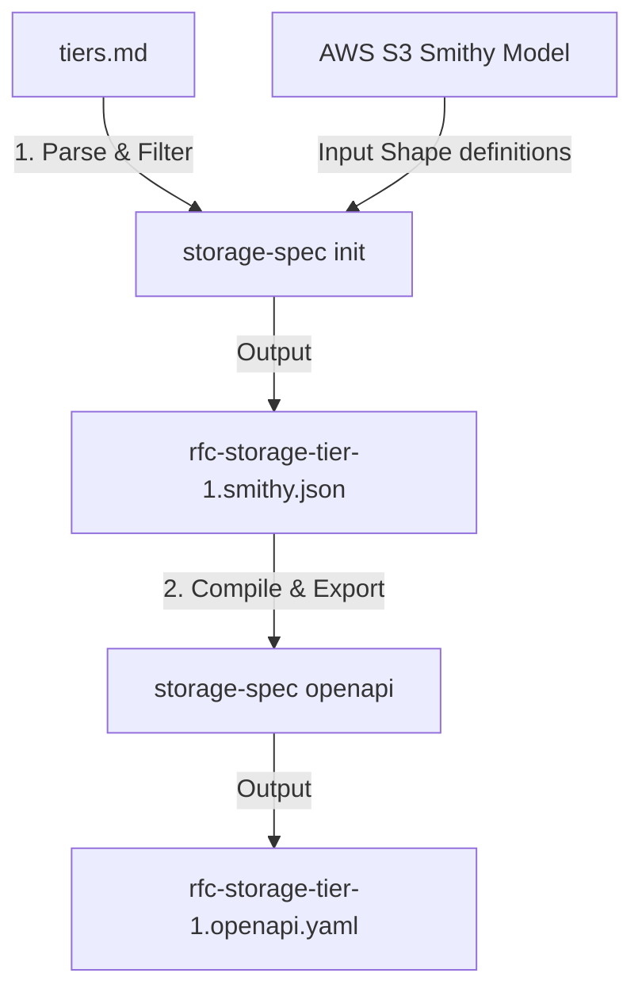

# Generating Storage Specs

The reproducible pipeline to map from AWS defined API spec to the per tier subset as md, smithy AST json, and openAPI yaml.

## Specification Formats: Smithy vs. OpenAPI

This project maintains two separate representations of the portable storage specification because they serve different engineering purposes:

### 1. Smithy AST JSON (`rfc-storage-tier-1.smithy.json`)
*   **The Source of Truth**: Smithy is AWS's modern IDL (Interface Definition Language) designed specifically to represent complex, protocol-heavy service APIs.
*   **Why we use it**: S3 is not a standard REST API. It uses unique routing semantics (e.g. mapping different operations like `CopyObject` and `PutObject` to the exact same HTTP path and method via query parameters and headers) and requires strict SigV4 cryptographic signature signing traits. Smithy allows us to model these AWS-specific traits, protocol choices, and structures perfectly.
*   **Primary Uses**: Service proxies, S3 client routing engines, and compliance capture tests.

### 2. OpenAPI 3.1 YAML (`rfc-storage-tier-1.openapi.yaml`)
*   **Developer-Friendly View**: A standard REST API representation of the subset.
*   **Why we generate it**: The standard REST tooling ecosystem is built around OpenAPI. By compiling our Smithy spec to OpenAPI, we enable developers to use standard API tools (such as Swagger, Redocly, and Postman), generate client libraries in dozens of languages, and spin up mock servers out-of-the-box.
*   **Overlapping HTTP Semantics**: Because multiple S3 operations map to the same HTTP path and method (e.g. `PUT /{Bucket}/{Key}` handles both object uploads and server-side copying), the generator merges these behaviors into single, clean, combined OpenAPI paths with descriptive, flat markdown documentation explaining the different request headers required for each behavior.

---

## Local Tooling Setup (Pre-publish)

Since the specification and tooling repositories are cloned as sibling directories, you can link the CLI tool globally to run it directly:
```bash
# From the parent directory:
cd ../storage-spec-cli
npm install
npm run build
npm link
cd ../storage
```

Now, the `storage-spec` command is registered globally on your machine.

---

## The Spec Pipeline

The specs are derived automatically in a two-stage process:



1. **Stage 1 (Filtering)**: The CLI tool reads the root `tiers.md` file, extracts the operation names listed under the Tier 1 section, and filters the canonical S3 Smithy AST shape definitions down to *only* those operations.
2. **Stage 2 (Conversion)**: The CLI converts the filtered Smithy AST JSON to a standard OpenAPI 3.1 YAML schema, translating traits and resolving endpoint overlaps (e.g. merging `PutObject` and `CopyObject`).

## How to Regenerate

Run the following commands from the root of the `storage` repository:

### 1. Generate the Filtered Smithy AST JSON
Downloads the raw AWS S3 models and filters them based on `tiers.md`:
```bash
storage-spec init --source ./tiers.md --output ./rfc-storage-tier-1.smithy.json
```

### 2. Generate the OpenAPI 3.1 YAML Schema
Compiles the filtered Smithy shapes into standard OpenAPI:
```bash
storage-spec openapi --input ./rfc-storage-tier-1.smithy.json --output ./rfc-storage-tier-1.openapi.yaml
```

*(Note: Once the module is published to the public registry, you can substitute `storage-spec` with `npx @cloud-portable/storage-spec`.)*
